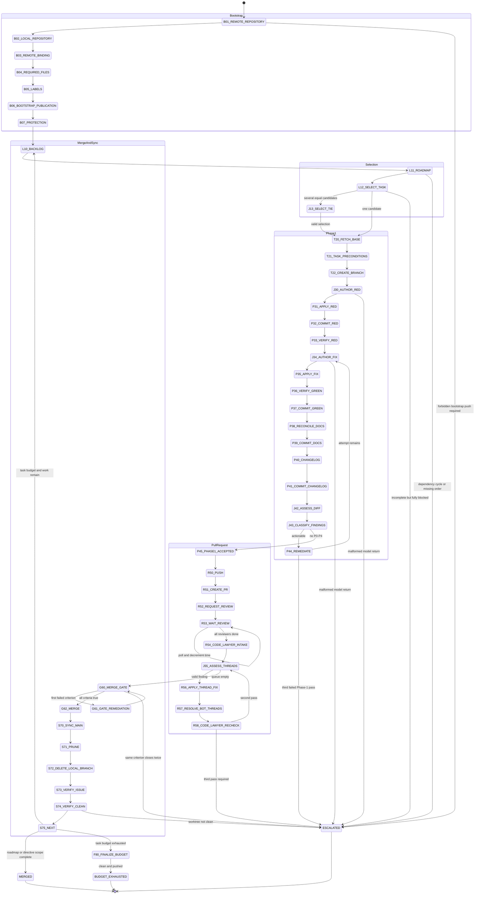

# Deterministic Delivery Loop Phase Graph

<!-- markdownlint-disable MD013 -->

Status: specification only.

Feasibility prerequisite: `docs/feasibility.md` reports
`not-yet-hostable`. The effects named here are required abstract interfaces,
not operations exposed by the current Edict-to-Echo seam.

## Scope

This document replaces phase ordering, gate evaluation, budget accounting,
repository routing, and authority rules in the delivery-loop prompt with one
state machine. It does not implement the machine.

The preserved prompt remains operative until the negative envelope tests pass.
The later operator authorization to use administrative merge applies to the
current human-directed run only. The target machine retains `AdminMerge` in
the forbidden set because the requested negative test requires that operation
to be unrepresentable.

## Machine state

```text
RunState {
  schema_version
  phase
  policy_digest
  stop_condition
  roadmap_order
  active_roadmap
  active_milestone
  repository_snapshot
  issue_snapshot
  dependency_snapshot
  task
  task_repository
  base_ref
  base_oid
  task_branch
  pull_request
  head_oid
  worktree_status
  phase1_attempts_used
  code_lawyer_passes_used
  reviewer_wait_remaining
  reviewer_status
  unclassified_findings_remaining
  gate_closure_count_by_criterion
  tasks_remaining
  staged_paths
  local_validation
  remote_validation
  escalation
}
```

Initial bounds:

```text
phase1_attempts_used = 0
code_lawyer_passes_used = 0
reviewer_wait_remaining = 15 minutes per pull request
gate_closure_count_by_criterion = 0 for every criterion
tasks_remaining = 8
```

Every transition commits the next `RunState` before its newly authorized
external effect begins. A resumed machine starts from the last committed
transition. The current runtime cannot provide that guarantee; this is a
requirement on the future host.

## Classification

Each loop element belongs to exactly one bucket. Deterministic work may consume
validated judgment output, but a model never chooses a transition, capability,
repository, branch, budget, gate result, or disposition rule.

| Loop element | Bucket | Machine treatment |
| --- | --- | --- |
| Bootstrap repository existence check | Deterministic | `B01_REMOTE_REPOSITORY` |
| Bootstrap local repository check | Deterministic | `B02_LOCAL_REPOSITORY` |
| Bootstrap origin verification | Deterministic | `B03_REMOTE_BINDING` |
| Required-file existence and create-only behavior | Deterministic | `B04_REQUIRED_FILES` |
| Required-label existence | Deterministic | `B05_LABELS` |
| Bootstrap commit and publication | Deterministic | `B06_BOOTSTRAP_PUBLICATION` |
| Branch-protection and collaborator inspection | Deterministic | `B07_PROTECTION` |
| BAD CODE and COOL IDEA duplicate matching | Deterministic | `L10_BACKLOG` |
| Repository routing | Deterministic | Exact routing table in policy |
| Cross-repository task split | Deterministic | One issue per repository |
| GitHub issue dependencies | Deterministic | GraphQL dependency mutation only |
| Tracking-issue maintenance | Deterministic | `L10_BACKLOG` |
| Milestone assignment and roadmap order | Deterministic | `L11_ROADMAP` |
| Dependency-cycle detection | Deterministic | Cycle means `ESCALATED` |
| Critical-path computation | Deterministic | Dependency DAG plus explicit roadmap order |
| Select a sole highest-priority candidate | Deterministic | `L12_SELECT_TASK` |
| Select among tied unblocked candidates | Judgment | `SelectTieTask` |
| Fetch and pin `origin/main` | Deterministic | `T20_FETCH_BASE` |
| Clean-tree, auth, and ref-current gates | Deterministic | `T21_TASK_PRECONDITIONS` |
| Branch naming and creation | Deterministic | `T22_CREATE_BRANCH` |
| Author RED tests | Judgment | `AuthorRedTests` |
| Test-suite shape check | Deterministic | Golden, failure, edge, seeded property, stress |
| RED execution and intended-failure check | Deterministic | `P33_VERIFY_RED` |
| Author the minimal fix | Judgment | `AuthorMinimalFix` |
| Apply a returned patch | Deterministic | Schema, path, size, and scope validation |
| GREEN execution | Deterministic | Repository-owned commands |
| Documentation reconciliation | Deterministic | Checked corpus projection; unresolved semantic drift escalates |
| Changelog insertion | Deterministic | Append one normalized entry under `Unreleased` |
| Commit-message and PR-intent summary | Judgment | `SummarizeIntent` |
| Explicit staging and commit | Deterministic | No implicit or all-path staging |
| Decide whether the diff achieves intent | Judgment | `AssessDiffIntent` |
| Classify a finding | Judgment | `ClassifyFinding` |
| Finding aggregation, ordering, grouping, histogram | Deterministic | Stable tuple ordering |
| Severity remediation routing | Deterministic | P0-P2 loop; P3-P4 in-place; P5 issue note |
| Phase-1 attempt accounting | Deterministic | Maximum three |
| Feature-branch push | Deterministic | Pinned non-main ref only |
| PR creation and closure reference | Deterministic | Host injects exact issue reference |
| Bot-review requests and polling | Deterministic | Fixed reviewers, interval, and deadline |
| Bot completion detection | Deterministic | Review, refusal, cooldown, timed acknowledgment, or deadline |
| Code Lawyer thread intake | Deterministic | Unresolved bot-authored threads only |
| Finding applicability to diff intent | Judgment | `AssessDiffIntent` |
| Thread outcome derivation | Deterministic | FIXED, DEFERRED, STALE, UNREPRODUCIBLE, BLOCKED |
| Bot-thread reply and resolution | Deterministic | Human-authored threads cannot be resolved |
| Code Lawyer pass accounting | Deterministic | Maximum two |
| Merge-gate evaluation and order | Deterministic | CI, threads, outcomes, local checks, approval |
| Merge method and non-admin rule | Deterministic | Policy-selected allowed method; no admin capability |
| Main sync, prune, local-branch deletion | Deterministic | Safe operations only |
| Issue closure verification | Deterministic | Close only the task issue with merge evidence |
| Outer-loop budget | Deterministic | Decrement after a completed task sync |
| Escalation trigger and record | Deterministic | First-class terminal transition |
| Final report | Deterministic | Projection from committed `RunState` |

Documentation prose is not a separate judgment capability. Before
`AuthorMinimalFix`, a deterministic affected-document projection may add exact
documentation paths and RED evidence to that leaf's scope. The implementation
and documentation edits are applied together, but deterministic staging keeps
their commits separate. `P38_RECONCILE_DOCS` only verifies that prepared
projection. If it finds unprepared drift, or the corpus cannot state its
required projection mechanically, the machine escalates with
`MissingDeterministicDocumentationProjection`.

## Predicates

Predicates are total functions over committed state and bounded observations.
An error while evaluating a predicate is `false` plus a named failure; it is
never an implicit permission.

```text
repo_route(issue) -> exactly one Repository
roadmap_order_is_total(state)
dependency_graph_is_acyclic(state)
critical_candidates(state) -> ordered finite set<IssueId>
tree_is_clean(state)
auth_is_valid(state)
base_is_current(state)
branch_is_feature_ref(state)
staged_paths_are_explicit(state)
red_suite_is_complete(state)
red_failed_for_intended_reason(state)
green_suite_passed(state)
docs_are_reconciled(state)
changelog_has_one_entry(state)
self_review_is_current_head(state)
reviewer_is_done(reviewer, state)
all_reviewers_done(state)
bot_threads_are_resolved(state)
code_lawyer_outcomes_are_admissible(state)
local_suite_is_clean(state)
approval_requirement_is_met(state)
merge_gate_criterion(n, state)
worktree_and_remote_are_synced(state)
task_issue_is_closed(state)
authorized_scope_is_complete(state)
has_unblocked_task(state)
budget_is_exhausted(state)
```

`merge_gate_criterion` evaluates in this order and stops at the first false
predicate:

1. all CI checks complete and passing;
2. no unresolved bot-authored review thread;
3. every Code Lawyer outcome is `FIXED`, `DEFERRED`, `STALE`, or
   `UNREPRODUCIBLE`;
4. repository suite and linters pass, excluding only a recorded baseline; and
5. required non-bot approval exists, or the recorded solo-maintainer
   substitution is valid.

## State diagram



## Effect catalog

These names identify future capabilities. They do not authorize a current
implementation.

| Effect | Scope |
| --- | --- |
| `RepoRead` | Read explicit repository files, status, refs, diff, log, and configuration. |
| `RepoCreate` | Create one named local repository or worktree at one resolved path. |
| `FileCreateMissing` | Create only an absent path from a checked template. |
| `FilePatch` | Apply a schema-validated patch to an exact attenuated path set. |
| `GitFetch` | Fetch one configured remote without rewriting refs. |
| `GitCreateFeatureBranch` | Create `task/<issue>-<slug>` from pinned `origin/main`. |
| `GitStageExplicit` | Stage a nonempty explicit path list; no wildcard or all-path mode. |
| `GitCommit` | Create a new commit; no amend or history rewrite. |
| `GitPushFeature` | Push the exact task ref; destination `main` is not constructible. |
| `GitSwitchMain` | Switch to the configured merge target when no other worktree owns it. |
| `GitPullFastForward` | Fast-forward only from the configured remote merge target. |
| `GitPrune` | Prune deleted remote-tracking refs. |
| `GitDeleteMergedLocalBranch` | Delete only when Git proves ordinary merged ancestry. |
| `GitHubRead` | Read one routed repository's issues, PRs, checks, reviews, labels, milestones, protection, and collaborators. |
| `GitHubRepositoryCreate` | Create the one policy-named repository with fixed visibility and license posture. |
| `GitHubMetadataWrite` | Create or edit routed issues, labels, milestones, PR descriptions, and comments. |
| `GitHubDependencyGraphQLWrite` | Add or remove a native `blocked by` edge using GraphQL node identities. |
| `GitHubCreatePullRequest` | Open one non-draft PR from the current feature ref to the pinned merge target. |
| `GitHubRequestBotReview` | Post the two fixed reviewer invocations. |
| `GitHubResolveBotThread` | Resolve only a bot-authored thread after a recorded disposition. |
| `GitHubMergePullRequest` | Merge an open gated PR using a repository-allowed non-admin method. |
| `ClockReadWitnessed` | Read bounded wait evidence for reviewer polling. |
| `RunRepositoryCommand` | Run an allow-listed test, formatter, linter, or read-only inspection command with bounded output. |
| `ModelCall.AuthorRedTests` | Invoke only the RED-test leaf. |
| `ModelCall.AuthorMinimalFix` | Invoke only the scoped fix leaf. |
| `ModelCall.ClassifyFinding` | Invoke only the finding-classification leaf. |
| `ModelCall.SummarizeIntent` | Invoke only the summary leaf. |
| `ModelCall.AssessDiffIntent` | Invoke only the diff-assessment leaf. |
| `ModelCall.SelectTieTask` | Invoke only the tied-task leaf. |
| `PersistRunState` | Atomically persist the next canonical machine state. |

There is no effect named `ForcePush`, `PushMain`, `Rebase`,
`RewritePublishedHistory`, `AdminMerge`, `ModifyCiWorkflow`,
`ResolveHumanThread`, `CloseHumanIssue`, `GenericShell`, or
`AmbientNetwork`.

## State and effect table

Every state may use only the listed effects. `PersistRunState` is implicit on
every successful transition and is the only effect shared by all states.

| State | Declared effects | Success condition |
| --- | --- | --- |
| `B01_REMOTE_REPOSITORY` | `GitHubRead`, optionally `GitHubRepositoryCreate` | Correct repository exists or creation succeeded. |
| `B02_LOCAL_REPOSITORY` | `RepoRead`, optionally `RepoCreate` | Local history is preserved or a new repository exists. |
| `B03_REMOTE_BINDING` | `RepoRead` | `origin` is exact; mismatch escalates. |
| `B04_REQUIRED_FILES` | `RepoRead`, `FileCreateMissing`, `GitStageExplicit`, `GitCommit` | Every required file exists without overwrite. |
| `B05_LABELS` | `GitHubRead`, `GitHubMetadataWrite` | Required labels exist. |
| `B06_BOOTSTRAP_PUBLICATION` | `RepoRead` | Existing remote `main` is usable; a required direct-main push escalates. |
| `B07_PROTECTION` | `GitHubRead` | Review policy and solo-maintainer posture are recorded. |
| `L10_BACKLOG` | `GitHubRead`, `GitHubMetadataWrite`, `GitHubDependencyGraphQLWrite` | Routed deduplicated backlog and tracking issues are current. |
| `L11_ROADMAP` | `GitHubRead`, `GitHubMetadataWrite` | Total milestone order exists and dependency graph is acyclic. |
| `L12_SELECT_TASK` | `GitHubRead` | Zero, one, or tied critical candidates are classified. |
| `J13_SELECT_TIE` | `ModelCall.SelectTieTask` | Returned issue is exactly one supplied candidate. |
| `T20_FETCH_BASE` | `GitFetch`, `RepoRead` | `origin/main` object identity is pinned. |
| `T21_TASK_PRECONDITIONS` | `RepoRead`, `GitHubRead` | Tree clean, auth valid, refs current, route unique. |
| `T22_CREATE_BRANCH` | `GitCreateFeatureBranch` | Exact policy branch points at pinned base. |
| `J30_AUTHOR_RED` | `ModelCall.AuthorRedTests` | Test patch schema and declared coverage are valid. |
| `P31_APPLY_RED` | `FilePatch` | Patch touches test-allowed paths only. |
| `P32_COMMIT_RED` | `ModelCall.SummarizeIntent`, `GitStageExplicit`, `GitCommit` | Explicit test paths committed. |
| `P33_VERIFY_RED` | `RunRepositoryCommand`, `RepoRead` | Suite fails for intended assertion, not compile/setup failure. |
| `J34_AUTHOR_FIX` | `ModelCall.AuthorMinimalFix` | Fix patch schema and attenuation validate. |
| `P35_APPLY_FIX` | `FilePatch` | Only current remediation paths change. |
| `P36_VERIFY_GREEN` | `RunRepositoryCommand`, `RepoRead` | RED suite and relevant regression suite pass. |
| `P37_COMMIT_GREEN` | `ModelCall.SummarizeIntent`, `GitStageExplicit`, `GitCommit` | Explicit implementation paths committed. |
| `P38_RECONCILE_DOCS` | `RunRepositoryCommand`, `RepoRead` | Checked doc projection is current or produces named RED evidence. |
| `P39_COMMIT_DOCS` | `ModelCall.SummarizeIntent`, `GitStageExplicit`, `GitCommit` | Explicit doc paths committed separately. |
| `P40_CHANGELOG` | `FilePatch` | One normalized `Unreleased` entry exists. |
| `P41_COMMIT_CHANGELOG` | `ModelCall.SummarizeIntent`, `GitStageExplicit`, `GitCommit` | Changelog path committed separately. |
| `J42_ASSESS_DIFF` | `ModelCall.AssessDiffIntent` | Typed assessment validates for current `HEAD`. |
| `J43_CLASSIFY_FINDINGS` | `ModelCall.ClassifyFinding` | Every finite finding has one valid classification. |
| `P44_REMEDIATE` | None | Deterministic severity route selected and attempt consumed. |
| `P45_PHASE1_ACCEPTED` | `RepoRead` | Current `HEAD` has no finding above P4 requiring action. |
| `R50_PUSH` | `GitPushFeature` | Remote feature ref equals current `HEAD`. |
| `R51_CREATE_PR` | `ModelCall.SummarizeIntent`, `GitHubCreatePullRequest` | Open PR targets configured main and closes exact issue. |
| `R52_REQUEST_REVIEW` | `GitHubRequestBotReview` | Both fixed requests recorded. |
| `R53_WAIT_REVIEW` | `GitHubRead`, `ClockReadWitnessed` | Both reviewers meet a completion rule or deadline. |
| `R54_CODE_LAWYER_INTAKE` | `GitHubRead` | Queue contains only unresolved bot threads for current head. |
| `J55_ASSESS_THREADS` | `ModelCall.AssessDiffIntent`, `ModelCall.ClassifyFinding` | Every queued thread has evidence and classification. |
| `R56_APPLY_THREAD_FIX` | `ModelCall.AuthorMinimalFix`, `FilePatch`, `RunRepositoryCommand`, `GitStageExplicit`, `GitCommit`, `GitPushFeature` | Valid finding fixed and tested on feature ref. |
| `R57_RESOLVE_BOT_THREADS` | `GitHubMetadataWrite`, `GitHubResolveBotThread` | Reply records outcome; bot thread resolved. |
| `R58_CODE_LAWYER_RECHECK` | `GitHubRead` | No new bot thread, or one remaining pass is selected. |
| `G60_MERGE_GATE` | `GitHubRead`, `RepoRead`, `RunRepositoryCommand` | Five ordered gate predicates are true. |
| `G61_GATE_REMEDIATION` | `GitHubRead`, `RepoRead`, `RunRepositoryCommand`, `ClockReadWitnessed` | First closure is re-observed once without mutation. |
| `G62_MERGE` | `GitHubMergePullRequest` | Gated PR merged without admin. |
| `S70_SYNC_MAIN` | `GitSwitchMain`, `GitPullFastForward` | Local merge target equals remote target. |
| `S71_PRUNE` | `GitFetch`, `GitPrune` | Deleted remote feature ref is absent. |
| `S72_DELETE_LOCAL_BRANCH` | `GitDeleteMergedLocalBranch` | Safe ancestry proof succeeds; otherwise branch is preserved and recorded. |
| `S73_VERIFY_ISSUE` | `GitHubRead`, conditionally `GitHubMetadataWrite` | Task issue closed with merge evidence. |
| `S74_VERIFY_CLEAN` | `RepoRead` | Worktree has no tracked or untracked change. |
| `S75_NEXT` | `GitHubRead` | Terminal or next-backlog transition selected. |
| `F80_FINALIZE_BUDGET` | `RepoRead`, conditionally `GitPushFeature` | Current commit pushed and worktree clean. |
| `MERGED` | None | Terminal success record emitted. |
| `ESCALATED` | None | Terminal escalation record emitted. |
| `BUDGET_EXHAUSTED` | None | Terminal budget record emitted. |

## Transition table

`fail(reason)` means a committed transition to `ESCALATED` with the exact
record format. A failed external effect never advances or silently retries the
phase; unless a transition names a bounded retry counter, it records evidence
and transitions to `ESCALATED`.

| From | Guard | To | Counter change or failure |
| --- | --- | --- | --- |
| Start | State schema and policy digest valid | `B01_REMOTE_REPOSITORY` | Invalid state fails closed. |
| `B01_REMOTE_REPOSITORY` | Repository exists or permitted creation succeeds | `B02_LOCAL_REPOSITORY` | Creation failure escalates. |
| `B02_LOCAL_REPOSITORY` | Local history preserved or new local repo created | `B03_REMOTE_BINDING` | Unexpected history escalates. |
| `B03_REMOTE_BINDING` | Origin absent and may be added, or exact | `B04_REQUIRED_FILES` | Conflicting origin escalates. |
| `B04_REQUIRED_FILES` | Existing files untouched; missing files created | `B05_LABELS` | Template/overwrite mismatch escalates. |
| `B05_LABELS` | Required labels exist | `B06_BOOTSTRAP_PUBLICATION` | Missing uncreatable label escalates. |
| `B06_BOOTSTRAP_PUBLICATION` | Remote main already exists | `B07_PROTECTION` | New-repo direct-main push need escalates. |
| `B07_PROTECTION` | Protection and collaborator facts recorded | `L10_BACKLOG` | Unreadable policy escalates. |
| `L10_BACKLOG` | Issues routed uniquely and dependency writes use GraphQL | `L11_ROADMAP` | Ambiguous route escalates. |
| `L11_ROADMAP` | Total roadmap order and acyclic dependency graph | `L12_SELECT_TASK` | Missing order or cycle escalates. |
| `L12_SELECT_TASK` | Exactly one highest-priority unblocked candidate | `T20_FETCH_BASE` | Candidate selected. |
| `L12_SELECT_TASK` | Several equal highest-priority candidates | `J13_SELECT_TIE` | Finite candidate set supplied. |
| `J13_SELECT_TIE` | Return is one supplied issue id | `T20_FETCH_BASE` | Malformed or foreign id escalates. |
| `L12_SELECT_TASK` | Roadmap complete | `MERGED` | Successful terminal. |
| `L12_SELECT_TASK` | Roadmap incomplete and no unblocked candidate | `ESCALATED` | Blocking set recorded. |
| `T20_FETCH_BASE` | Fetch succeeds and `origin/main` is pinned | `T21_TASK_PRECONDITIONS` | Moving/absent base escalates. |
| `T21_TASK_PRECONDITIONS` | Clean, authenticated, current, uniquely routed | `T22_CREATE_BRANCH` | Any false gate escalates. |
| `T22_CREATE_BRANCH` | Exact branch created from pinned base | `J30_AUTHOR_RED` | Name/ref mismatch escalates. |
| `J30_AUTHOR_RED` | Typed patch includes all five test classes | `P31_APPLY_RED` | Malformed output escalates. |
| `P31_APPLY_RED` | Patch validates within test scope | `P32_COMMIT_RED` | Scope/path violation escalates. |
| `P32_COMMIT_RED` | Explicit paths staged and new commit created | `P33_VERIFY_RED` | Empty/all-path/amend attempt escalates. |
| `P33_VERIFY_RED` | Intended behavioral assertion fails | `J34_AUTHOR_FIX` | Compile/setup/pass result escalates. |
| `J34_AUTHOR_FIX` | Typed patch validates within current scope | `P35_APPLY_FIX` | Malformed output escalates. |
| `P35_APPLY_FIX` | Patch applies with no scope escape | `P36_VERIFY_GREEN` | Scope/path violation escalates. |
| `P36_VERIFY_GREEN` | Relevant suites pass | `P37_COMMIT_GREEN` | Failure returns named evidence to `J34`; consumes attempt. |
| `P37_COMMIT_GREEN` | Explicit implementation commit exists | `P38_RECONCILE_DOCS` | Commit policy violation escalates. |
| `P38_RECONCILE_DOCS` | Prepared corpus projection passes | `P39_COMMIT_DOCS` | Unprepared or nondeterministic documentation drift escalates. |
| `P39_COMMIT_DOCS` | Separate explicit doc commit exists or no doc delta | `P40_CHANGELOG` | Mixed staging escalates. |
| `P40_CHANGELOG` | Exactly one normalized entry inserted | `P41_COMMIT_CHANGELOG` | Ambiguous section escalates. |
| `P41_COMMIT_CHANGELOG` | Separate changelog commit exists | `J42_ASSESS_DIFF` | Mixed staging escalates. |
| `J42_ASSESS_DIFF` | Typed assessment validates | `J43_CLASSIFY_FINDINGS` | Malformed return escalates. |
| `J43_CLASSIFY_FINDINGS` | Findings remain | `J43_CLASSIFY_FINDINGS` | Decrement finite finding count. |
| `J43_CLASSIFY_FINDINGS` | No actionable P0-P4 finding | `P45_PHASE1_ACCEPTED` | P5 notes are recorded deterministically. |
| `J43_CLASSIFY_FINDINGS` | Actionable finding and attempt count below three | `P44_REMEDIATE` | Increment `phase1_attempts_used`. |
| `P44_REMEDIATE` | Remediation route is valid and fewer than three passes are used | `J34_AUTHOR_FIX` | A required fourth pass, or P0-P2 after pass three, escalates. |
| `P45_PHASE1_ACCEPTED` | Review binds current head | `R50_PUSH` | Stale review returns to assessment. |
| `R50_PUSH` | Remote feature ref equals head | `R51_CREATE_PR` | Any main destination escalates. |
| `R51_CREATE_PR` | PR targets main and body closes exact issue | `R52_REQUEST_REVIEW` | Malformed PR state escalates. |
| `R52_REQUEST_REVIEW` | Both fixed reviewer requests exist | `R53_WAIT_REVIEW` | A failed request effect escalates. |
| `R53_WAIT_REVIEW` | Reviewer incomplete and time remains | `R53_WAIT_REVIEW` | Subtract witnessed elapsed time; poll no faster than 60 seconds. |
| `R53_WAIT_REVIEW` | Every reviewer done by rule or deadline | `R54_CODE_LAWYER_INTAKE` | Deadline is completion, not approval. |
| `R54_CODE_LAWYER_INTAKE` | Queue built from unresolved bot threads | `J55_ASSESS_THREADS` | Human threads remain untouched. |
| `J55_ASSESS_THREADS` | Queue empty | `G60_MERGE_GATE` | Outcomes complete. |
| `J55_ASSESS_THREADS` | Valid fixable finding and pass remains | `R56_APPLY_THREAD_FIX` | Increment lawyer pass on completed pass. |
| `J55_ASSESS_THREADS` | Finding cannot safely progress | `R57_RESOLVE_BOT_THREADS` | Record `BLOCKED`; gate will close. |
| `R56_APPLY_THREAD_FIX` | Patch tested, committed, pushed | `R57_RESOLVE_BOT_THREADS` | Any failure records `BLOCKED`; no hidden retry loop. |
| `R57_RESOLVE_BOT_THREADS` | Outcome reply exists for bot thread | `R58_CODE_LAWYER_RECHECK` | Human author means no resolution effect. |
| `R58_CODE_LAWYER_RECHECK` | New bot threads and fewer than two passes used | `J55_ASSESS_THREADS` | Increment pass count. |
| `R58_CODE_LAWYER_RECHECK` | Third pass would be required | `ESCALATED` | Exact thread ids recorded. |
| `R58_CODE_LAWYER_RECHECK` | No new bot thread | `G60_MERGE_GATE` | Queue stable. |
| `G60_MERGE_GATE` | All five criteria true in order | `G62_MERGE` | Gate-open record committed. |
| `G60_MERGE_GATE` | First false criterion has closed once | `G61_GATE_REMEDIATION` | Increment that criterion count. |
| `G60_MERGE_GATE` | Same criterion closes a second time | `ESCALATED` | Criterion and evidence recorded. |
| `G61_GATE_REMEDIATION` | One bounded re-observation completes | `G60_MERGE_GATE` | No mutation or free-running wait loop. |
| `G62_MERGE` | Current gated head merges without admin | `S70_SYNC_MAIN` | Changed head or admin need escalates. |
| `S70_SYNC_MAIN` | Fast-forward sync succeeds | `S71_PRUNE` | Divergence escalates; no rebase. |
| `S71_PRUNE` | Remote feature ref is pruned | `S72_DELETE_LOCAL_BRANCH` | Unexpected remote state escalates. |
| `S72_DELETE_LOCAL_BRANCH` | Ordinary merged-ancestry deletion succeeds | `S73_VERIFY_ISSUE` | Otherwise preserve branch and record it. |
| `S73_VERIFY_ISSUE` | Issue is closed or closed with merge reference | `S74_VERIFY_CLEAN` | Human-authored unrelated issue untouched. |
| `S74_VERIFY_CLEAN` | Worktree clean | `S75_NEXT` | Dirty tree escalates without cleanup. |
| `S75_NEXT` | Authorized scope complete by roadmap or directive | `MERGED` | Successful terminal. |
| `S75_NEXT` | Task budget reaches zero | `F80_FINALIZE_BUDGET` | `tasks_remaining -= 1` before guard. |
| `S75_NEXT` | Budget remains and unblocked work exists | `L10_BACKLOG` | `tasks_remaining -= 1`. |
| `S75_NEXT` | Roadmap incomplete but fully blocked | `ESCALATED` | Blocking set recorded. |
| `F80_FINALIZE_BUDGET` | Current commit pushed and tree clean | `BUDGET_EXHAUSTED` | Terminal budget record. |

## Judgment leaves

Model output is untrusted input. The host validates canonical encoding, schema,
size, enum membership, repository identity, path scope, and referenced object
identity before it may change state. Every malformed return transitions to
`ESCALATED` with `MalformedJudgmentReturn`; the host does not repair, coerce, or
ask the same leaf to reinterpret its output.

### `AuthorRedTests`

```text
AuthorRedTests(
  task: TaskSpec,
  repository: PinnedRepositorySnapshot,
  acceptance: AcceptanceCriteria,
  constraints: TestConstraints,
  writable_paths: ExactPathSet
) -> TestPatch {
  patch,
  cases: {
    golden: NonEmpty<TestCaseId>,
    failure: NonEmpty<TestCaseId>,
    boundary: NonEmpty<TestCaseId>,
    property: NonEmpty<{test, fixed_seed}>,
    stress: NonEmpty<{test, bound}>
  }
}
```

The leaf receives no Git, network, GitHub, process, or unrestricted filesystem
capability. A path outside `writable_paths`, a missing fixed seed, an unbounded
stress case, or a CI-workflow path is malformed.

### `AuthorMinimalFix`

```text
AuthorMinimalFix(
  task: TaskSpec,
  repository: PinnedRepositorySnapshot,
  red_evidence: NonEmpty<FailureEvidence>,
  current_diff: CanonicalDiff,
  writable_paths: ExactPathSet
) -> FixPatch {
  patch,
  addressed_evidence: NonEmpty<EvidenceId>
}
```

The host applies the patch. The leaf cannot invoke Git, a shell, GitHub, the
network, or another model. The writable set is the deterministic intersection
of task scope, current diff scope, repository policy, and affected-document
projection.

### `ClassifyFinding`

```text
ClassifyFinding(
  finding: FindingEvidence,
  task: TaskSpec,
  diff: CanonicalDiff
) -> FindingClassification {
  severity: P0 | P1 | P2 | P3 | P4 | P5,
  category: Correctness | Security | DataIntegrity | Concurrency |
            Performance | Compatibility | Maintainability | Documentation,
  confidence: Integer<0..100>,
  rationale: BoundedText,
  locations: Bounded<Location>
}
```

Sorting, grouping, histogram construction, and remediation routing are host
operations. A location outside the supplied diff must be explicitly marked
pre-existing; otherwise the return is malformed.

### `SummarizeIntent`

```text
SummarizeIntent(
  kind: Commit | PullRequest,
  task: TaskSpec,
  diff: CanonicalDiff,
  validation: ValidationSummary
) -> IntentSummary {
  subject: BoundedText,
  body: BoundedText
}
```

The host validates the text and injects branch names, issue closure references,
SHAs, and gate facts. The leaf cannot choose those identifiers or perform the
commit/PR effect.

### `AssessDiffIntent`

```text
AssessDiffIntent(
  task: TaskSpec,
  diff: CanonicalDiff,
  validation: ValidationEvidence,
  review_threads: Bounded<ReviewThreadEvidence>
) -> DiffAssessment {
  achieves_intent: Boolean,
  evidence: NonEmpty<EvidenceId>,
  candidate_findings: Bounded<FindingEvidence>,
  thread_assessments: Bounded<{
    thread_id,
    applies: Boolean,
    reproduced: Boolean,
    evidence
  }>
}
```

The host derives `STALE` from object identity, `UNREPRODUCIBLE` from a false
reproduction backed by supplied evidence, `FIXED` from current-head validation,
and `DEFERRED` only from a routed issue reference. An unexplained false value is
malformed.

### `SelectTieTask`

```text
SelectTieTask(
  candidates: NonEmpty<AtLeastTwo<CriticalPathCandidate>>,
  roadmap: RoadmapSnapshot
) -> IssueId
```

The return must equal one candidate id. Repository routing and dependency
eligibility are not model inputs to alter.

## Finding order and outcomes

The host orders findings by:

```text
(severity index, repository, path, line, category, normalized rationale digest)
```

Severity index is P0 through P5. The histogram is a six-element count vector.
No model-generated ordering or grouping is accepted.

Thread outcomes are:

- `FIXED`: current-head test and diff evidence prove the finding repaired;
- `DEFERRED`: an in-scope routed issue exists and the present task may safely
  land without the change;
- `STALE`: the referenced current-head object or line no longer exists;
- `UNREPRODUCIBLE`: bounded reproduction evidence contradicts the finding;
- `BLOCKED`: the finding remains applicable and no authorized remediation can
  complete it.

Only the first four satisfy the merge gate.

## Reachability and progress proof

Every non-terminal state has a path to a terminal:

1. Bootstrap and selection states advance linearly or transition to
   `ESCALATED`.
2. Phase 1 advances to publication, or each new remediation pass increments
   `phase1_attempts_used`. No fourth pass exists. A third pass that still has
   P0-P2 transitions to `ESCALATED`; P3-P4 repairs must finish within the same
   three-pass bound.
3. Finding-classification self-loops decrement a finite finding count.
4. Bot polling subtracts witnessed elapsed time from a 15-minute budget. At
   zero, the reviewer is deterministically complete for this run.
5. Code Lawyer consumes at most two passes. A required third pass transitions
   to `ESCALATED`.
6. A failed merge criterion gets one bounded remediation/re-observation.
   Closing the same criterion twice transitions to `ESCALATED`. Since the gate
   has five criteria, criterion rotation cannot create an infinite loop.
7. Every successful task sync decrements `tasks_remaining`. At zero, the
   machine reaches `BUDGET_EXHAUSTED` after clean/pushed finalization.
8. A completed authorized scope reaches `MERGED`. Scope can end because the
   active roadmap is complete or because a directive requires a successful
   stop after a named deliverable. For this run, the D1
   `not-yet-hostable` verdict sets `stop_condition = after D2`. An incomplete
   scope with no unblocked task reaches `ESCALATED` with its blocking set.

No legal cycle lacks a strictly decreasing finite measure.

## Defects exposed in the prose loop

1. **Bootstrap contradiction.** Creating an empty remote and then publishing
   the initial commit requires a direct push to `main`, but the autonomy
   envelope forbids direct main pushes. The machine escalates rather than
   inventing an exception. Existing repositories skip this path.
2. **Missing review protocols.** `.agent/self-code-review.md` and
   `.agent/code-lawyer.md` are not present in the current Hello Echo or Graft
   repository. A future runtime must consume digest-bound protocol artifacts;
   absent artifacts fail closed. This specification uses only the deltas
   explicitly present in the operative prompt.
3. **Undefined roadmap order storage.** GitHub milestone numbers do not by
   themselves encode the requested capability order. `roadmap_order` must be an
   explicit total order; absence or conflict escalates.
4. **CI wait ambiguity.** The prompt bounds bot wait but not a free-running CI
   wait. The phase graph permits only the one gate re-observation implied by
   "the same criterion twice"; a second CI closure escalates.
5. **Documentation authorship tension.** The judgment whitelist has no general
   prose-authoring leaf. Documentation changes must be a path-attenuated
   `AuthorMinimalFix` response to deterministic corpus RED evidence, or the task
   escalates.
6. **Squash cleanup mismatch.** Safe local branch deletion may reject a
   squash-merged branch because ancestry differs. Force deletion is absent, so
   the machine preserves and reports that local branch.
7. **Administrative merge override.** The current operator allowed this agent
   to use `--admin`; the requested target negative tests still classify
   `AdminMerge` as forbidden. The target policy remains the stricter one until
   the pivot directive is explicitly changed.

## Escalation record

```text
🛑 ESCALATION — <phase>: <condition>
Task:        <repo>#<issue> — <title>
Attempts:    <n>
Evidence:    <check, thread ID, test, command, or state digest>
Blocked on:  <single operator decision>
```

The record is constructed from committed state. A model cannot change its
phase, attempts, evidence identifiers, or requested decision.

## Terminals

- `MERGED`: the current task is safely merged and the authorized scope is
  complete, either because the active roadmap is complete or a committed
  directive stop condition has been reached.
- `ESCALATED`: a named guard, authority, dependency, malformed judgment,
  repeated failure, or external-state condition requires one operator decision.
- `BUDGET_EXHAUSTED`: eight completed task iterations have been consumed and
  the final feature commit is pushed with a clean worktree.

Because D1 is `not-yet-hostable`, this committed phase graph is the final
deliverable for the current pivot. D3 through D6 must not begin in this run.

<!-- markdownlint-enable MD013 -->
