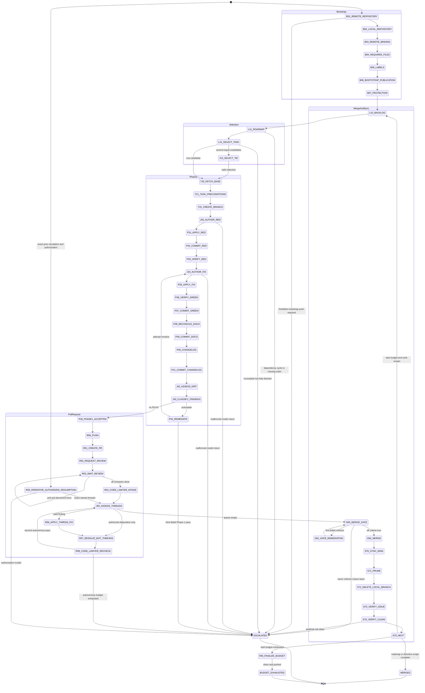

# Deterministic Delivery Loop Phase Graph

<!-- markdownlint-disable MD013 -->

Status: specification only.

Feasibility prerequisite: `docs/feasibility.md` reports
`not-yet-hostable`. The effects named here are required abstract interfaces,
not operations exposed by the current Edict-to-Echo seam.

## Scope

This document replaces phase ordering, gate evaluation, budget accounting,
repository routing, and authority rules in the delivery-loop prompt with one
state machine. It does not implement the machine. `docs/roadmap.md` places that
implementation in Roadmap Ω after smaller external-action proofs.

The preserved prompt remains the human-directed delivery protocol until the
negative envelope tests pass. It is not authoritative for roadmap ordering.
The later operator authorization to use administrative merge applies to the
current human-directed run only. The target machine retains `AdminMerge` in the
forbidden set because the requested negative test requires that operation to be
unrepresentable.

## Machine state

```text
RunState {
  schema_version
  phase
  policy_digest
  stop_condition
  roadmap_order
  active_roadmap
  active_milestone
  repository_snapshot
  issue_snapshot
  dependency_snapshot
  task
  task_repository
  base_ref
  base_oid
  task_branch
  pull_request
  head_oid
  worktree_status
  phase1_attempts_used
  code_lawyer_passes_used
  operator_remediation_passes_used
  operator_authorization
  prior_escalation
  reviewer_wait_remaining
  reviewer_status
  unclassified_findings_remaining
  gate_closure_count_by_criterion
  tasks_remaining
  staged_paths
  local_validation
  remote_validation
  escalation
}
```

Initial bounds:

```text
phase1_attempts_used = 0
code_lawyer_passes_used = 0
operator_remediation_passes_used = 0
operator_authorization = none
prior_escalation = none
reviewer_wait_remaining = 15 minutes per pull request
gate_closure_count_by_criterion = 0 for every criterion
tasks_remaining = 8
```

Every transition commits the next `RunState` and typed external request before
an adapter acts. The adapter may act only after Echo records a bounded claim.
Echo admits the settlement before the program resumes. A resumed machine starts
from committed program state and history, not a serialized native stack. The
current runtime cannot provide that guarantee; this is a requirement on the
future host.

## Classification

Each loop element belongs to exactly one of three buckets. Deterministic law may
consume admitted observations and validated judgment output. An external
interaction may observe or mutate the world only through a typed request and
settlement. Judgment returns proposal data. A model never chooses a transition,
capability, repository, branch, budget, gate result, or disposition rule.

| Loop element | Bucket | Machine treatment |
| --- | --- | --- |
| Observe remote repository existence | External interaction | `B01_REMOTE_REPOSITORY` request and settlement |
| Observe local repository | External interaction | `B02_LOCAL_REPOSITORY` request and settlement |
| Verify admitted origin observation | Deterministic law | `B03_REMOTE_BINDING` |
| Observe or create missing scaffold file | External interaction | `B04_REQUIRED_FILES` request and settlement |
| Observe or create required label | External interaction | `B05_LABELS` request and settlement |
| Evaluate bootstrap-publication preconditions | Deterministic law | `B06_BOOTSTRAP_PUBLICATION`; direct-main need escalates |
| Observe branch protection and collaborators | External interaction | `B07_PROTECTION` request and settlement |
| Match BAD CODE and COOL IDEA duplicates | Deterministic law | Operates on admitted issue snapshot |
| Repository routing | Deterministic law | Exact routing table in policy |
| Cross-repository task split | Deterministic law | One issue per repository |
| Mutate GitHub issue dependencies | External interaction | GraphQL dependency request only |
| Mutate tracking issue | External interaction | `L10_BACKLOG` request and settlement |
| Choose milestone and roadmap position | Deterministic law | Explicit total order |
| Assign milestone | External interaction | `L11_ROADMAP` request and settlement |
| Detect dependency cycle | Deterministic law | Cycle means `ESCALATED` |
| Compute critical path | Deterministic law | Dependency DAG plus explicit roadmap order |
| Select a sole highest-priority candidate | Deterministic law | `L12_SELECT_TASK` |
| Select among tied unblocked candidates | Judgment | `SelectTieTask` |
| Fetch and observe `origin/main` | External interaction | `T20_FETCH_BASE` request and settlement |
| Evaluate clean-tree, auth, and ref-current gates | Deterministic law | `T21_TASK_PRECONDITIONS` |
| Create policy-named feature branch | External interaction | `T22_CREATE_BRANCH` request and settlement |
| Author RED tests | Judgment | `AuthorRedTests` |
| Validate proposed test-suite shape | Deterministic law | Golden, failure, edge, seeded property, stress |
| Apply validated test patch | External interaction | `P31_APPLY_RED` request and settlement |
| Run registered RED check | External interaction | `P33_VERIFY_RED` request and settlement |
| Evaluate intended RED failure | Deterministic law | Assertion failure, not compile/setup failure |
| Author the minimal fix | Judgment | `AuthorMinimalFix` |
| Validate a patch proposal | Deterministic law | Schema, basis, path, size, and policy |
| Apply a validated patch | External interaction | `P35_APPLY_FIX` request and settlement |
| Run registered GREEN check | External interaction | Repository-owned registered check |
| Evaluate GREEN result | Deterministic law | Required assertions pass |
| Reconcile documentation | Deterministic law | Checked projection; unresolved semantic drift escalates |
| Apply validated documentation patch | External interaction | Exact prepared document paths |
| Normalize changelog insertion | Deterministic law | One entry under `Unreleased` |
| Apply validated changelog patch | External interaction | Exact changelog path |
| Commit-message and PR-intent summary | Judgment | `SummarizeIntent` |
| Create commit from explicit paths | External interaction | No implicit or all-path staging |
| Decide whether the diff achieves intent | Judgment | `AssessDiffIntent` |
| Classify a finding | Judgment | `ClassifyFinding` |
| Aggregate, order, group, and count findings | Deterministic law | Stable tuple ordering |
| Route severity remediation | Deterministic law | P0-P2 loop; P3-P4 in-place; P5 issue note |
| Account Phase-1 attempts | Deterministic law | Maximum three |
| Push feature ref | External interaction | Pinned non-main ref only |
| Open PR with closure reference | External interaction | Host injects exact issue reference |
| Request and observe bot review | External interaction | Fixed reviewers, interval, and deadline |
| Detect bot completion | Deterministic law | Review, refusal, cooldown, timed acknowledgment, or deadline |
| Build Code Lawyer intake | Deterministic law | Unresolved bot-authored threads only |
| Finding applicability to diff intent | Judgment | `AssessDiffIntent` |
| Derive thread outcome | Deterministic law | FIXED, SATISFIED_BY_DEPENDENCY, DEFERRED, STALE, UNREPRODUCIBLE, BLOCKED |
| Reply to or resolve bot thread | External interaction | Human-authored threads cannot be resolved |
| Account autonomous Code Lawyer passes | Deterministic law | Maximum two; escalation does not reset the count |
| Admit operator authorization | External interaction | Exact prior escalation, PR head, mode, and finite bot-thread set |
| Validate operator-authorized work | Deterministic law | At most one named remediation pass; disposition-only cannot mutate |
| Evaluate merge gate in order | Deterministic law | CI, threads, outcomes, local checks, approval |
| Merge gated PR | External interaction | Policy-selected allowed method; no admin operation |
| Sync, prune, and delete safe branch | External interaction | Separate bounded requests |
| Verify task issue closure | Deterministic law | Exact task and merge evidence |
| Close merged task issue | External interaction | Exact task issue only |
| Account outer-loop budget | Deterministic law | Decrement after a completed task sync |
| Select escalation and record fields | Deterministic law | First-class terminal transition |
| Project final report | Deterministic law | Projection from committed `RunState` |

Documentation prose is not a separate judgment capability. Before
`AuthorMinimalFix`, a deterministic affected-document projection may add exact
documentation paths and RED evidence to that leaf's proposal policy.
`P38_RECONCILE_DOCS` prepares and validates that projection without mutation.
`P39_COMMIT_DOCS` emits the `ApplyValidatedPatch` request; after settlement it
creates the separate documentation commit from explicit paths. The model
receives no write capability. If reconciliation finds unprepared drift, or the
corpus cannot state its required projection mechanically, the machine escalates
with `MissingDeterministicDocumentationProjection`.

## Predicates

Predicates are total functions over committed state and bounded observations.
An error while evaluating a predicate is `false` plus a named failure; it is
never an implicit permission.

```text
repo_route(issue) -> exactly one Repository
roadmap_order_is_total(state)
dependency_graph_is_acyclic(state)
critical_candidates(state) -> ordered finite set<IssueId>
tree_is_clean(state)
auth_is_valid(state)
base_is_current(state)
branch_is_feature_ref(state)
staged_paths_are_explicit(state)
red_suite_is_complete(state)
red_failed_for_intended_reason(state)
green_suite_passed(state)
docs_are_reconciled(state)
changelog_has_one_entry(state)
self_review_is_current_head(state)
reviewer_is_done(reviewer, state)
all_reviewers_done(state)
bot_threads_are_resolved(state)
code_lawyer_outcomes_are_admissible(state)
local_suite_is_clean(state)
approval_requirement_is_met(state)
merge_gate_criterion(n, state)
worktree_and_remote_are_synced(state)
task_issue_is_closed(state)
authorized_scope_is_complete(state)
has_unblocked_task(state)
budget_is_exhausted(state)
```

`merge_gate_criterion` evaluates in this order and stops at the first false
predicate:

1. all CI checks complete and passing;
2. no unresolved bot-authored review thread;
3. every Code Lawyer outcome is `FIXED`, `SATISFIED_BY_DEPENDENCY`, `DEFERRED`,
   `STALE`, or `UNREPRODUCIBLE`;
4. repository suite and linters pass, excluding only a recorded baseline; and
5. required non-bot approval exists, or the recorded solo-maintainer
   substitution is valid.

## State diagram



## Effect catalog

These names identify future external-operation request families. They do not
authorize a current implementation. Edict may construct a declared request;
Echo records and coordinates it; an operation-specific adapter alone performs
it.

| Effect | Scope |
| --- | --- |
| `ObserveRepositorySnapshot` | Observe explicit files, status, refs, diff, log, and configuration under one repository basis. |
| `CreateRepositoryScaffold` | Create one policy-named local repository or worktree at one resolved path. |
| `CreateMissingScaffoldFile` | Create only an absent required path from a checked template. |
| `ApplyValidatedPatch` | Apply one already validated patch to its exact basis and path set. |
| `FetchPinnedBase` | Fetch one configured remote and return the observed base identity without rewriting history. |
| `CreateFeatureBranch` | Create `task/<issue>-<slug>` from a pinned `origin/main`. |
| `CreateCommitFromExplicitPaths` | Stage a nonempty explicit path set and create a new commit; no wildcard, amend, or rewrite. |
| `PushFeatureRef` | Push the exact task ref; destination `main` and force are not request fields. |
| `SyncMainFastForward` | Switch and fast-forward only the configured merge target when the worktree lease permits it. |
| `PruneRemoteRefs` | Fetch and prune deleted remote-tracking refs without deleting unrelated refs. |
| `DeleteOrdinarilyMergedBranch` | Delete only when ordinary ancestry proves the local branch merged. |
| `ObserveGitHubState` | Observe bounded issues, PRs, checks, reviews, labels, milestones, protection, or collaborators for one repository. |
| `CreateConfiguredRepository` | Create the one policy-named repository with fixed visibility and license posture. |
| `EnsureRequiredLabels` | Create only missing policy-declared labels with fixed metadata. |
| `CreateOrUpdateTrackedIssue` | Create or edit one routed issue from admitted issue data. |
| `AssignMilestone` | Assign one issue to the deterministic roadmap milestone. |
| `SetIssueDependency` | Add or remove one native `blocked by` edge using GraphQL node identities. |
| `OpenTaskPullRequest` | Open one non-draft PR from the current feature ref to the pinned merge target. |
| `RequestFixedBotReviews` | Post the two policy-declared reviewer requests. |
| `ObserveOperatorAuthorization` | Admit one operator directive bound to an exact prior escalation, PR head, mode, and finite bot-thread set. |
| `ReplyToBotThread` | Post one disposition reply to a bot-authored thread. |
| `ResolveBotThread` | Resolve only a bot-authored thread after a recorded disposition. |
| `MergeGatedPullRequest` | Merge the exact gated head with a repository-allowed non-admin method. |
| `CloseMergedTaskIssue` | Close only the task issue with admitted merge evidence. |
| `ObserveTimerSettlement` | Admit bounded elapsed-time evidence for polling. |
| `RunRegisteredCheck` | Run one registry-declared check with a source basis, resource budget, and bounded result schema. |
| `RequestModelJudgment.AuthorRedTests` | Request only the RED-test proposal leaf. |
| `RequestModelJudgment.AuthorMinimalFix` | Request only the scoped fix-proposal leaf. |
| `RequestModelJudgment.ClassifyFinding` | Request only the finding-classification leaf. |
| `RequestModelJudgment.SummarizeIntent` | Request only the summary leaf. |
| `RequestModelJudgment.AssessDiffIntent` | Request only the diff-assessment leaf. |
| `RequestModelJudgment.SelectTieTask` | Request only the tied-task leaf. |
| `PersistRunState` | Atomically persist the next canonical machine state. |

There is no operation named `ForcePush`, `PushMain`, `Rebase`,
`RewritePublishedHistory`, `AdminMerge`, `ModifyCiWorkflow`,
`ResolveHumanThread`, `CloseHumanIssue`, `GenericShell`, or
`AmbientNetwork`.

Every external operation follows:

```text
REQUESTED
  -> CLAIMED
  -> SETTLED(succeeded | rejected | failed | outcome_unknown)
```

The request commits before adapter execution. The settlement commits before
the program consumes it. Replay reads an existing settlement and never creates
a new claim for a settled request. An intentional fork that consults the
current world creates a new worldline and request identity.

## State and effect table

Every state may use only the listed effects. `PersistRunState` is implicit on
every successful transition and is the only effect shared by all states.

| State | Declared effects | Success condition |
| --- | --- | --- |
| `B01_REMOTE_REPOSITORY` | `ObserveGitHubState`, optionally `CreateConfiguredRepository` | Correct repository exists or creation succeeded. |
| `B02_LOCAL_REPOSITORY` | `ObserveRepositorySnapshot`, optionally `CreateRepositoryScaffold` | Local history is preserved or a new repository exists. |
| `B03_REMOTE_BINDING` | `ObserveRepositorySnapshot` | `origin` is exact; mismatch escalates. |
| `B04_REQUIRED_FILES` | `ObserveRepositorySnapshot`, `CreateMissingScaffoldFile`, `CreateCommitFromExplicitPaths` | Every required file exists without overwrite. |
| `B05_LABELS` | `ObserveGitHubState`, `EnsureRequiredLabels` | Required labels exist. |
| `B06_BOOTSTRAP_PUBLICATION` | `ObserveRepositorySnapshot` | Existing remote `main` is usable; a required direct-main push escalates. |
| `B07_PROTECTION` | `ObserveGitHubState` | Review policy and solo-maintainer posture are recorded. |
| `L10_BACKLOG` | `ObserveGitHubState`, `CreateOrUpdateTrackedIssue`, `SetIssueDependency` | Routed deduplicated backlog and tracking issues are current. |
| `L11_ROADMAP` | `ObserveGitHubState`, `AssignMilestone` | Total milestone order exists and dependency graph is acyclic. |
| `L12_SELECT_TASK` | `ObserveGitHubState` | Zero, one, or tied critical candidates are classified. |
| `J13_SELECT_TIE` | `RequestModelJudgment.SelectTieTask` | Returned issue is exactly one supplied candidate. |
| `T20_FETCH_BASE` | `FetchPinnedBase`, `ObserveRepositorySnapshot` | `origin/main` object identity is pinned. |
| `T21_TASK_PRECONDITIONS` | `ObserveRepositorySnapshot`, `ObserveGitHubState` | Tree clean, auth valid, refs current, route unique. |
| `T22_CREATE_BRANCH` | `CreateFeatureBranch` | Exact policy branch points at pinned base. |
| `J30_AUTHOR_RED` | `RequestModelJudgment.AuthorRedTests` | Test proposal schema and declared coverage are valid. |
| `P31_APPLY_RED` | `ApplyValidatedPatch` | Validated patch touches test-allowed paths only. |
| `P32_COMMIT_RED` | `RequestModelJudgment.SummarizeIntent`, `CreateCommitFromExplicitPaths` | Explicit test paths committed. |
| `P33_VERIFY_RED` | `RunRegisteredCheck`, `ObserveRepositorySnapshot` | Suite fails for intended assertion, not compile/setup failure. |
| `J34_AUTHOR_FIX` | `RequestModelJudgment.AuthorMinimalFix` | Fix proposal schema and policy validate. |
| `P35_APPLY_FIX` | `ApplyValidatedPatch` | Only current remediation paths change. |
| `P36_VERIFY_GREEN` | `RunRegisteredCheck`, `ObserveRepositorySnapshot` | RED suite and relevant regression suite pass. |
| `P37_COMMIT_GREEN` | `RequestModelJudgment.SummarizeIntent`, `CreateCommitFromExplicitPaths` | Explicit implementation paths committed. |
| `P38_RECONCILE_DOCS` | `RunRegisteredCheck`, `ObserveRepositorySnapshot` | Checked doc projection is current or produces named RED evidence. |
| `P39_COMMIT_DOCS` | `RequestModelJudgment.SummarizeIntent`, `ApplyValidatedPatch`, `CreateCommitFromExplicitPaths` | Explicit doc paths committed separately. |
| `P40_CHANGELOG` | `ApplyValidatedPatch` | One normalized `Unreleased` entry exists. |
| `P41_COMMIT_CHANGELOG` | `RequestModelJudgment.SummarizeIntent`, `CreateCommitFromExplicitPaths` | Changelog path committed separately. |
| `J42_ASSESS_DIFF` | `RequestModelJudgment.AssessDiffIntent` | Typed assessment validates for current `HEAD`. |
| `J43_CLASSIFY_FINDINGS` | `RequestModelJudgment.ClassifyFinding` | Every finite finding has one valid classification. |
| `P44_REMEDIATE` | None | Deterministic severity route selected and attempt consumed. |
| `P45_PHASE1_ACCEPTED` | `ObserveRepositorySnapshot` | Current `HEAD` has no finding above P4 requiring action. |
| `R50_PUSH` | `PushFeatureRef` | Remote feature ref equals current `HEAD`. |
| `R51_CREATE_PR` | `RequestModelJudgment.SummarizeIntent`, `OpenTaskPullRequest` | Open PR targets configured main and closes exact issue. |
| `R52_REQUEST_REVIEW` | `RequestFixedBotReviews` | Both fixed requests recorded. |
| `R53_WAIT_REVIEW` | `ObserveGitHubState`, `ObserveTimerSettlement` | Both reviewers meet a completion rule or deadline. |
| `R54_CODE_LAWYER_INTAKE` | `ObserveGitHubState` | Queue contains only unresolved bot threads for current head. |
| `J55_ASSESS_THREADS` | `RequestModelJudgment.AssessDiffIntent`, `RequestModelJudgment.ClassifyFinding` | Every queued thread has evidence and classification. |
| `R56_APPLY_THREAD_FIX` | `RequestModelJudgment.AuthorMinimalFix`, `ApplyValidatedPatch`, `RunRegisteredCheck`, `CreateCommitFromExplicitPaths`, `PushFeatureRef` | Valid finding fixed and tested on feature ref. |
| `R57_RESOLVE_BOT_THREADS` | `ReplyToBotThread`, `ResolveBotThread` | Reply records outcome; bot thread resolved. |
| `R58_CODE_LAWYER_RECHECK` | `ObserveGitHubState` | No new bot thread, or one remaining pass is selected. |
| `R59_OPERATOR_AUTHORIZED_RESUMPTION` | `ObserveOperatorAuthorization`, `ObserveGitHubState` | Authorization is exact, bounded, unconsumed, and bound to the current PR head. |
| `G60_MERGE_GATE` | `ObserveGitHubState`, `ObserveRepositorySnapshot`, `RunRegisteredCheck` | Five ordered gate predicates are true. |
| `G61_GATE_REMEDIATION` | `ObserveGitHubState`, `ObserveRepositorySnapshot`, `RunRegisteredCheck`, `ObserveTimerSettlement` | First closure is re-observed once without mutation. |
| `G62_MERGE` | `MergeGatedPullRequest` | Gated PR merged without admin. |
| `S70_SYNC_MAIN` | `SyncMainFastForward` | Local merge target equals remote target. |
| `S71_PRUNE` | `PruneRemoteRefs` | Deleted remote feature ref is absent. |
| `S72_DELETE_LOCAL_BRANCH` | `DeleteOrdinarilyMergedBranch` | Safe ancestry proof succeeds; otherwise branch is preserved and recorded. |
| `S73_VERIFY_ISSUE` | `ObserveGitHubState`, conditionally `CloseMergedTaskIssue` | Task issue closed with merge evidence. |
| `S74_VERIFY_CLEAN` | `ObserveRepositorySnapshot` | Worktree has no tracked or untracked change. |
| `S75_NEXT` | `ObserveGitHubState` | Terminal or next-backlog transition selected. |
| `F80_FINALIZE_BUDGET` | `ObserveRepositorySnapshot`, conditionally `PushFeatureRef` | Current commit pushed and worktree clean. |
| `MERGED` | None | Terminal success record emitted. |
| `ESCALATED` | None | Terminal escalation record emitted. |
| `BUDGET_EXHAUSTED` | None | Terminal budget record emitted. |

## Transition table

`fail(reason)` means a committed transition to `ESCALATED` with the exact
record format. A rejected or failed external settlement never advances or
silently retries the phase. An ambiguous effect becomes `outcome_unknown`; it
is not collapsed into failure. Unless a transition names a bounded retry
counter, it records evidence and transitions to `ESCALATED`.

`ESCALATED` remains terminal. An operator-authorized continuation creates a new
run whose `prior_escalation` is the exact terminal record. The new run retains
the autonomous pass count and any consumed operator-remediation count. It does
not transition out of, rewrite, or reset the terminal run.

| From | Guard | To | Counter change or failure |
| --- | --- | --- | --- |
| Start | State schema and policy digest valid | `B01_REMOTE_REPOSITORY` | Invalid state fails closed. |
| Authorized resume | Prior terminal is Code Lawyer pass exhaustion; authorization binds its PR head and named bot threads | `R59_OPERATOR_AUTHORIZED_RESUMPTION` | New run retains all prior pass counts. |
| `B01_REMOTE_REPOSITORY` | Repository exists or permitted creation succeeds | `B02_LOCAL_REPOSITORY` | Creation failure escalates. |
| `B02_LOCAL_REPOSITORY` | Local history preserved or new local repo created | `B03_REMOTE_BINDING` | Unexpected history escalates. |
| `B03_REMOTE_BINDING` | Origin absent and may be added, or exact | `B04_REQUIRED_FILES` | Conflicting origin escalates. |
| `B04_REQUIRED_FILES` | Existing files untouched; missing files created | `B05_LABELS` | Template/overwrite mismatch escalates. |
| `B05_LABELS` | Required labels exist | `B06_BOOTSTRAP_PUBLICATION` | Missing uncreatable label escalates. |
| `B06_BOOTSTRAP_PUBLICATION` | Remote main already exists | `B07_PROTECTION` | New-repo direct-main push need escalates. |
| `B07_PROTECTION` | Protection and collaborator facts recorded | `L10_BACKLOG` | Unreadable policy escalates. |
| `L10_BACKLOG` | Issues routed uniquely and dependency writes use GraphQL | `L11_ROADMAP` | Ambiguous route escalates. |
| `L11_ROADMAP` | Total roadmap order and acyclic dependency graph | `L12_SELECT_TASK` | Missing order or cycle escalates. |
| `L12_SELECT_TASK` | Exactly one highest-priority unblocked candidate | `T20_FETCH_BASE` | Candidate selected. |
| `L12_SELECT_TASK` | Several equal highest-priority candidates | `J13_SELECT_TIE` | Finite candidate set supplied. |
| `J13_SELECT_TIE` | Return is one supplied issue id | `T20_FETCH_BASE` | Malformed or foreign id escalates. |
| `L12_SELECT_TASK` | Roadmap complete | `MERGED` | Successful terminal. |
| `L12_SELECT_TASK` | Roadmap incomplete and no unblocked candidate | `ESCALATED` | Blocking set recorded. |
| `T20_FETCH_BASE` | Fetch succeeds and `origin/main` is pinned | `T21_TASK_PRECONDITIONS` | Moving/absent base escalates. |
| `T21_TASK_PRECONDITIONS` | Clean, authenticated, current, uniquely routed | `T22_CREATE_BRANCH` | Any false gate escalates. |
| `T22_CREATE_BRANCH` | Exact branch created from pinned base | `J30_AUTHOR_RED` | Name/ref mismatch escalates. |
| `J30_AUTHOR_RED` | Typed patch includes all five test classes | `P31_APPLY_RED` | Malformed output escalates. |
| `P31_APPLY_RED` | Patch validates within test scope | `P32_COMMIT_RED` | Scope/path violation escalates. |
| `P32_COMMIT_RED` | Explicit paths staged and new commit created | `P33_VERIFY_RED` | Empty/all-path/amend attempt escalates. |
| `P33_VERIFY_RED` | Intended behavioral assertion fails | `J34_AUTHOR_FIX` | Compile/setup/pass result escalates. |
| `J34_AUTHOR_FIX` | Typed patch validates within current scope | `P35_APPLY_FIX` | Malformed output escalates. |
| `P35_APPLY_FIX` | Patch applies with no scope escape | `P36_VERIFY_GREEN` | Scope/path violation escalates. |
| `P36_VERIFY_GREEN` | Relevant suites pass | `P37_COMMIT_GREEN` | Failure returns named evidence to `J34`; consumes attempt. |
| `P37_COMMIT_GREEN` | Explicit implementation commit exists | `P38_RECONCILE_DOCS` | Commit policy violation escalates. |
| `P38_RECONCILE_DOCS` | Prepared corpus projection passes | `P39_COMMIT_DOCS` | Unprepared or nondeterministic documentation drift escalates. |
| `P39_COMMIT_DOCS` | Validated doc patch settles and a separate explicit doc commit exists, or no doc delta exists | `P40_CHANGELOG` | Patch or staging failure escalates. |
| `P40_CHANGELOG` | Exactly one normalized entry inserted | `P41_COMMIT_CHANGELOG` | Ambiguous section escalates. |
| `P41_COMMIT_CHANGELOG` | Separate changelog commit exists | `J42_ASSESS_DIFF` | Mixed staging escalates. |
| `J42_ASSESS_DIFF` | Typed assessment validates | `J43_CLASSIFY_FINDINGS` | Malformed return escalates. |
| `J43_CLASSIFY_FINDINGS` | Findings remain | `J43_CLASSIFY_FINDINGS` | Decrement finite finding count. |
| `J43_CLASSIFY_FINDINGS` | No actionable P0-P4 finding | `P45_PHASE1_ACCEPTED` | P5 notes are recorded deterministically. |
| `J43_CLASSIFY_FINDINGS` | Actionable finding and attempt count below three | `P44_REMEDIATE` | Increment `phase1_attempts_used`. |
| `P44_REMEDIATE` | Remediation route is valid and fewer than three passes are used | `J34_AUTHOR_FIX` | A required fourth pass, or P0-P2 after pass three, escalates. |
| `P45_PHASE1_ACCEPTED` | Review binds current head | `R50_PUSH` | Stale review returns to assessment. |
| `R50_PUSH` | Remote feature ref equals head | `R51_CREATE_PR` | Any main destination escalates. |
| `R51_CREATE_PR` | PR targets main and body closes exact issue | `R52_REQUEST_REVIEW` | Malformed PR state escalates. |
| `R52_REQUEST_REVIEW` | Both fixed reviewer requests exist | `R53_WAIT_REVIEW` | A failed request effect escalates. |
| `R53_WAIT_REVIEW` | Reviewer incomplete and time remains | `R53_WAIT_REVIEW` | Subtract witnessed elapsed time; poll no faster than 60 seconds. |
| `R53_WAIT_REVIEW` | Every reviewer done by rule or deadline | `R54_CODE_LAWYER_INTAKE` | Deadline is completion, not approval. |
| `R54_CODE_LAWYER_INTAKE` | Queue is empty | `G60_MERGE_GATE` | No Code Lawyer pass is consumed. |
| `R54_CODE_LAWYER_INTAKE` | Queue built from unresolved bot threads; no autonomous pass used | `J55_ASSESS_THREADS` | Set `code_lawyer_passes_used = 1`; human threads remain untouched. |
| `J55_ASSESS_THREADS` | Queue empty | `G60_MERGE_GATE` | Outcomes complete. |
| `J55_ASSESS_THREADS` | Valid fixable finding and autonomous or operator remediation authority remains | `R56_APPLY_THREAD_FIX` | No counter reset or implicit additional pass. |
| `J55_ASSESS_THREADS` | Gate-admissible outcome exists and disposition-only authority names the thread | `R57_RESOLVE_BOT_THREADS` | Repository mutation and review-request effects are absent. |
| `J55_ASSESS_THREADS` | Finding cannot safely progress | `R57_RESOLVE_BOT_THREADS` | Record `BLOCKED`; gate will close. |
| `R56_APPLY_THREAD_FIX` | Patch tested, committed, pushed | `R57_RESOLVE_BOT_THREADS` | Any failure records `BLOCKED`; no hidden retry loop. |
| `R57_RESOLVE_BOT_THREADS` | Outcome reply exists for bot thread | `R58_CODE_LAWYER_RECHECK` | Human author means no resolution effect. |
| `R58_CODE_LAWYER_RECHECK` | New bot threads and fewer than two passes used | `J55_ASSESS_THREADS` | Increment pass count. |
| `R58_CODE_LAWYER_RECHECK` | New bot threads and two autonomous passes used | `ESCALATED` | Exact thread ids recorded; autonomous count remains two. |
| `R58_CODE_LAWYER_RECHECK` | Operator-authorized run observes an unadmitted thread | `ESCALATED` | No authorization widening or implicit new bot cycle. |
| `R58_CODE_LAWYER_RECHECK` | No new bot thread | `G60_MERGE_GATE` | Queue stable. |
| `R59_OPERATOR_AUTHORIZED_RESUMPTION` | Mode is `remediation_pass`, named threads are exact, and no operator remediation pass was used | `J55_ASSESS_THREADS` | Set `operator_remediation_passes_used = 1`; autonomous count is unchanged. |
| `R59_OPERATOR_AUTHORIZED_RESUMPTION` | Mode is `disposition_only`, named threads are exact, and admitted evidence permits a gate-admissible outcome | `J55_ASSESS_THREADS` | Patch, commit, push, and review-request effects remain unavailable. |
| `R59_OPERATOR_AUTHORIZED_RESUMPTION` | Authorization is broad, reused, mismatched, or requests a second operator remediation pass | `ESCALATED` | Reject without thread or repository mutation. |
| `G60_MERGE_GATE` | All five criteria true in order | `G62_MERGE` | Gate-open record committed. |
| `G60_MERGE_GATE` | First false criterion has closed once | `G61_GATE_REMEDIATION` | Increment that criterion count. |
| `G60_MERGE_GATE` | Same criterion closes a second time | `ESCALATED` | Criterion and evidence recorded. |
| `G61_GATE_REMEDIATION` | One bounded re-observation completes | `G60_MERGE_GATE` | No mutation or free-running wait loop. |
| `G62_MERGE` | Current gated head merges without admin | `S70_SYNC_MAIN` | Changed head or admin need escalates. |
| `S70_SYNC_MAIN` | Fast-forward sync succeeds | `S71_PRUNE` | Divergence escalates; no rebase. |
| `S71_PRUNE` | Remote feature ref is pruned | `S72_DELETE_LOCAL_BRANCH` | Unexpected remote state escalates. |
| `S72_DELETE_LOCAL_BRANCH` | Ordinary merged-ancestry deletion succeeds | `S73_VERIFY_ISSUE` | Otherwise preserve branch and record it. |
| `S73_VERIFY_ISSUE` | Issue is closed or closed with merge reference | `S74_VERIFY_CLEAN` | Human-authored unrelated issue untouched. |
| `S74_VERIFY_CLEAN` | Worktree clean | `S75_NEXT` | Dirty tree escalates without cleanup. |
| `S75_NEXT` | Authorized scope complete by roadmap or directive | `MERGED` | Successful terminal. |
| `S75_NEXT` | Task budget reaches zero | `F80_FINALIZE_BUDGET` | `tasks_remaining -= 1` before guard. |
| `S75_NEXT` | Budget remains and unblocked work exists | `L10_BACKLOG` | `tasks_remaining -= 1`. |
| `S75_NEXT` | Roadmap incomplete but fully blocked | `ESCALATED` | Blocking set recorded. |
| `F80_FINALIZE_BUDGET` | Current commit pushed and tree clean | `BUDGET_EXHAUSTED` | Terminal budget record. |

## Judgment leaves

Model output is untrusted input. The host validates canonical encoding, schema,
size, enum membership, repository identity, path scope, and referenced object
identity before it may change state. Every malformed return transitions to
`ESCALATED` with `MalformedJudgmentReturn`; the host does not repair, coerce, or
ask the same leaf to reinterpret its output.

### `AuthorRedTests`

```text
AuthorRedTests(
  task: TaskSpec,
  repository: PinnedRepositorySnapshot,
  acceptance: AcceptanceCriteria,
  constraints: TestConstraints,
  proposable_paths: ExactPathSet
) -> TestPatchProposal {
  patch,
  cases: {
    golden: NonEmpty<TestCaseId>,
    failure: NonEmpty<TestCaseId>,
    boundary: NonEmpty<TestCaseId>,
    property: NonEmpty<{test, fixed_seed}>,
    stress: NonEmpty<{test, bound}>
  }
}
```

The leaf receives no Git, network, GitHub, process, or filesystem-write
capability. A path outside `proposable_paths`, a missing fixed seed, an
unbounded stress case, or a CI-workflow path is malformed. Deterministic law
validates the proposal before Echo may admit an `ApplyValidatedPatch` request.

### `AuthorMinimalFix`

```text
AuthorMinimalFix(
  task: TaskSpec,
  repository: PinnedRepositorySnapshot,
  red_evidence: NonEmpty<FailureEvidence>,
  current_diff: CanonicalDiff,
  proposable_paths: ExactPathSet
) -> PatchProposal {
  patch,
  addressed_evidence: NonEmpty<EvidenceId>
}
```

The leaf cannot invoke Git, a shell, GitHub, the network, another model, or a
filesystem write. The admissible proposal set is the deterministic
intersection of task scope, current diff scope, repository policy, and
affected-document projection. Deterministic law validates the proposal against
the current basis. Echo then records an `ApplyValidatedPatch` request before a
workspace adapter performs the mutation.

### `ClassifyFinding`

```text
ClassifyFinding(
  finding: FindingEvidence,
  task: TaskSpec,
  diff: CanonicalDiff
) -> FindingClassification {
  severity: P0 | P1 | P2 | P3 | P4 | P5,
  category: Correctness | Security | DataIntegrity | Concurrency |
            Performance | Compatibility | Maintainability | Documentation,
  confidence: Integer<0..100>,
  rationale: BoundedText,
  locations: Bounded<Location>
}
```

Sorting, grouping, histogram construction, and remediation routing are host
operations. A location outside the supplied diff must be explicitly marked
pre-existing; otherwise the return is malformed.

### `SummarizeIntent`

```text
SummarizeIntent(
  kind: Commit | PullRequest,
  task: TaskSpec,
  diff: CanonicalDiff,
  validation: ValidationSummary
) -> IntentSummary {
  subject: BoundedText,
  body: BoundedText
}
```

The host validates the text and injects branch names, issue closure references,
SHAs, and gate facts. The leaf cannot choose those identifiers or perform the
commit/PR effect.

### `AssessDiffIntent`

```text
AssessDiffIntent(
  task: TaskSpec,
  diff: CanonicalDiff,
  validation: ValidationEvidence,
  review_threads: Bounded<ReviewThreadEvidence>,
  dependency_evidence: Bounded<AdmittedDependencyEvidence>
) -> DiffAssessment {
  achieves_intent: Boolean,
  evidence: NonEmpty<EvidenceId>,
  candidate_findings: Bounded<FindingEvidence>,
  thread_assessments: Bounded<{
    thread_id,
    applies: Boolean,
    reproduced: Boolean,
    evidence
  }>,
  dependency_assessment: Optional<{
    evidence_id,
    consumer_change_required: Boolean,
    rationale: BoundedText
  }>
}
```

The host derives `STALE` from object identity, `UNREPRODUCIBLE` from a false
reproduction backed by supplied evidence, `FIXED` from current-head validation,
`SATISFIED_BY_DEPENDENCY` from a validated dependency assessment whose consumer
change flag is false, and `DEFERRED` only from a routed issue reference. The
host projects repository, issue, PR, and commit identities from admitted
dependency evidence; the model cannot invent or replace them. An unexplained
false value or an unknown evidence identity is malformed.

### `SelectTieTask`

```text
SelectTieTask(
  candidates: NonEmpty<AtLeastTwo<CriticalPathCandidate>>,
  roadmap: RoadmapSnapshot
) -> IssueId
```

The return must equal one candidate id. Repository routing and dependency
eligibility are not model inputs to alter.

## Finding order and outcomes

The host orders findings by:

```text
(severity index, repository, path, line, category, normalized rationale digest)
```

Severity index is P0 through P5. The histogram is a six-element count vector.
No model-generated ordering or grouping is accepted.

Thread outcomes are:

- `FIXED`: current-head test and diff evidence prove the finding repaired;
- `SATISFIED_BY_DEPENDENCY`: admitted producer-owned evidence proves the
  consumer finding satisfied and no consumer change is required;
- `DEFERRED`: an in-scope routed issue exists and the present task may safely
  land without the change;
- `STALE`: the referenced current-head object or line no longer exists;
- `UNREPRODUCIBLE`: bounded reproduction evidence contradicts the finding;
- `BLOCKED`: the finding remains applicable and no authorized remediation can
  complete it.

Only the first five satisfy the merge gate.

`SATISFIED_BY_DEPENDENCY` has this canonical record:

```text
{
  outcome: SATISFIED_BY_DEPENDENCY,
  owning_repo: RepositoryId,
  issue: IssueNumber,
  pr: PullRequestNumber,
  commit: FullCommitOid,
  consumer_change_required: false,
  rationale: BoundedText
}
```

The host admits the record only when the producer PR is merged, `commit` is in
its merged dependency closure, the evidence addresses the exact consumer
finding, and the consumer requires no change. A true or absent
`consumer_change_required` value is not coercible and does not satisfy the
gate. This is not `STALE`: the consumer thread can remain anchored to current
code. It is not `UNREPRODUCIBLE`: the concern may be valid while its proof is
owned by a dependency.

The motivating admitted record is:

```text
outcome: SATISFIED_BY_DEPENDENCY
owning_repo: flyingrobots/echo
issue: 699
pr: 700
commit: 63482dc4dd219d51769b79b80173610ca180f7d2
consumer_change_required: false
rationale: Echo's producer-owned negative and integration coverage closes the
  Hello Echo duplicate-state finding without a consumer change.
```

## Reachability and progress proof

Every non-terminal state has a path to a terminal:

1. Bootstrap and selection states advance linearly or transition to
   `ESCALATED`.
2. Phase 1 advances to publication, or each new remediation pass increments
   `phase1_attempts_used`. No fourth pass exists. A third pass that still has
   P0-P2 transitions to `ESCALATED`; P3-P4 repairs must finish within the same
   three-pass bound.
3. Finding-classification self-loops decrement a finite finding count.
4. Bot polling subtracts witnessed elapsed time from a 15-minute budget. At
   zero, the reviewer is deterministically complete for this run.
5. Code Lawyer consumes at most two autonomous passes. A required third
   autonomous pass transitions to `ESCALATED`. A new run may consume at most
   one exact operator-authorized remediation pass; its counter cannot reset. A
   disposition-only authorization decrements a finite named-thread set and
   cannot enter a patch, commit, push, or review-request state. Any unadmitted
   thread escalates.
6. A failed merge criterion gets one bounded remediation/re-observation.
   Closing the same criterion twice transitions to `ESCALATED`. Since the gate
   has five criteria, criterion rotation cannot create an infinite loop.
7. Every successful task sync decrements `tasks_remaining`. At zero, the
   machine reaches `BUDGET_EXHAUSTED` after clean/pushed finalization.
8. A completed authorized scope reaches `MERGED`. Scope can end because the
   active roadmap is complete or because a directive requires a successful
   stop after a named deliverable. For the discovery run, D1's
   `not-yet-hostable` verdict requires blocker filing, D2, and then a stop. An
   incomplete scope with no unblocked task reaches `ESCALATED` with its
   blocking set.

No legal cycle lacks a strictly decreasing finite measure.

## Defects exposed in the prose loop

1. **Missing external-interaction category.** The original deterministic versus
   judgment split misclassified filesystem, process, Git, GitHub, network,
   timer, and model calls. Those operations are mechanical but depend on an
   external world. They require recorded requests and witnessed settlements.
2. **Bootstrap contradiction.** Creating an empty remote and then publishing
   the initial commit requires a direct push to `main`, but the autonomy
   envelope forbids direct main pushes. The machine escalates rather than
   inventing an exception. Existing repositories skip this path.
3. **Missing review protocols.** `.agent/self-code-review.md` and
   `.agent/code-lawyer.md` are not present in the current Hello Echo or Graft
   repository. A future runtime must consume digest-bound protocol artifacts;
   absent artifacts fail closed. This specification uses only the deltas
   explicitly present in the operative prompt.
4. **Undefined roadmap order storage.** GitHub milestone numbers do not by
   themselves encode the requested capability order. `roadmap_order` must be an
   explicit total order; absence or conflict escalates.
5. **CI wait ambiguity.** The prompt bounds bot wait but not a free-running CI
   wait. The phase graph permits only the one gate re-observation implied by
   "the same criterion twice"; a second CI closure escalates.
6. **Documentation authorship tension.** The judgment whitelist has no general
   prose-authoring leaf. Documentation changes must be a path-attenuated
   `AuthorMinimalFix` proposal in response to deterministic corpus RED evidence.
   The proposal is validated before an adapter receives an
   `ApplyValidatedPatch` request.
7. **Squash cleanup mismatch.** Safe local branch deletion may reject a
   squash-merged branch because ancestry differs. Force deletion is absent, so
   the machine preserves and reports that local branch.
8. **Administrative merge override.** The current operator allowed this agent
   to use `--admin`; the requested target negative tests still classify
   `AdminMerge` as forbidden. The target policy remains the stricter one until
   the pivot directive is explicitly changed.
9. **Blocker-filing order.** D1 can discover that the seam is not hostable. A
   stop immediately after D2 would skip the issue and dependency reconciliation
   needed to preserve those blockers. Blocker filing therefore occurs between
   D1 and D2; D3-D5 implementation still stops.
10. **Cross-repository review disposition.** The original outcome vocabulary
    forced producer-owned proof into `STALE` or `UNREPRODUCIBLE`, even when the
    consumer thread remained current and conceptually valid.
    `SATISFIED_BY_DEPENDENCY` records the merged producer issue, PR, commit, and
    no-consumer-change decision without copying producer behavior into the
    consumer.
11. **Pass and disposition conflation.** A no-change operator disposition was
    indistinguishable from another remediation pass. The machine now keeps two
    autonomous passes, one separately counted named operator remediation pass,
    and finite disposition-only authority that cannot mutate or request review.

## Escalation record

```text
🛑 ESCALATION — <phase>: <condition>
Task:        <repo>#<issue> — <title>
Attempts:    <n>
Evidence:    <check, thread ID, test, command, or state digest>
Blocked on:  <single operator decision>
```

The record is constructed from committed state. A model cannot change its
phase, attempts, evidence identifiers, or requested decision.

## Terminals

- `MERGED`: the current task is safely merged and the authorized scope is
  complete, either because the active roadmap is complete or a committed
  directive stop condition has been reached.
- `ESCALATED`: a named guard, authority, dependency, malformed judgment,
  repeated failure, or external-state condition requires one operator decision.
  A later authorization starts a new run bound to this immutable terminal; it
  does not reopen or reset it.
- `BUDGET_EXHAUSTED`: eight completed task iterations have been consumed and
  the final feature commit is pushed with a clean worktree.

Because D1 is `not-yet-hostable`, this phase graph and the intervening blocker
filing are the final discovery artifacts. D3-D5 delivery-loop implementation
does not begin. `docs/roadmap.md` restores Pure Hello Echo as Roadmap A and
moves this machine to Roadmap Ω.

<!-- markdownlint-enable MD013 -->
