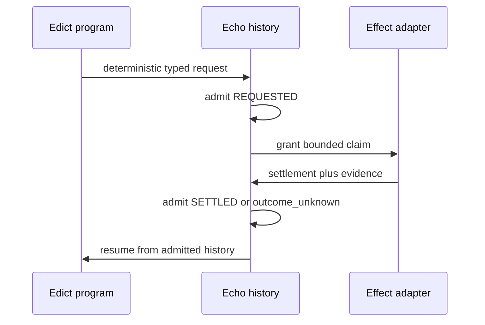

# Graft on Echo Roadmap

Status: active ordering.

Hello Echo proves the smallest compiler-to-runtime path. External effects are a
separate extension. The autonomous delivery loop is the capstone, not the
bootstrap application.

## Responsibility split

Every operation belongs to one of three categories.

<!-- markdownlint-disable MD013 -->

| Category | Examples | Owner |
| --- | --- | --- |
| Deterministic law | transition guards, budgets, routing, sorting | Edict program |
| External interaction | workspace observation, patch application, GitHub calls, timers | Echo-coordinated adapter |
| Judgment | test proposal, fix proposal, finding classification | Model or oracle adapter |

<!-- markdownlint-enable MD013 -->

Mechanical work is not necessarily deterministic. Reading a live worktree,
observing CI, waiting for a timer, and calling GitHub depend on an external
world. Edict governs those crossings by constructing typed request values; it
does not perform them.

## External-action boundary

The minimum protocol is:

The outbound request enters history before an adapter acts. A settlement enters
history before the program resumes. Replay consumes the recorded settlement and
does not reissue the external operation.

The request authority and execution authority are distinct:

- Edict may construct only operation identities declared in the package
  closure.
- Echo admits, schedules, correlates, and durably settles requests.
- An operation-specific adapter alone holds filesystem, process, network, Git,
  GitHub, timer, or model credentials.
- Model output is untrusted proposal data. It carries no mutation capability.
- Static closure rejects undeclared operation families. Runtime admission
  rejects out-of-scope paths, refs, bases, budgets, and other dynamic values.

## Roadmap A — Pure Hello Echo

Prove the existing compiler and runtime seam without external effects:

1. build a compiler-produced package from exact Edict source and capability
   closure;
2. admit the independent verification report;
3. execute through scheduler-owned Actions and atomic Ticks;
4. recover the package, Action, Tick, state, outcome, and Receipt after restart;
5. obstruct duplicate submission while exposing equal before/after
   application-state roots and typed target-value digests;
6. refuse an altered pre-Tick basis; and
7. prove replay equivalence; and
8. retain the exact compiler-authored typed application result through
   independent verification, scheduler evaluation, and WAL recovery.

Roadmap A ends when the standalone witness passes without a runtime fake,
native application callback, handwritten package, or host-checkout path.

The standalone witness now covers all eight steps with one Action in one Tick.
The generic runner reopens one persisted WAL for pending and decided recovery;
the external suite separately proves byte-identical deterministic reruns from
the same empty-WAL basis. Duplicate no-mutation proof compares Echo-produced
graph-only application-state roots and typed target-value digests; it does not
mistake the legitimately extended WAL, Tick history, or Receipt evidence for
application mutation. The application result remains the exact canonical
`GreetingCreated { key, message }` value declared by Edict; Echo reports and
recovers generic typed bytes without application-specific reconstruction. The
external suite independently requires the applied, fresh-host, and
WAL-recovered result records to be exactly equal. This is a singleton scheduler
proof, not a claim that the permanent multi-Action Tick model is complete.
Roadmap A.1 begins only after the runtime witness lands on `main`.

## Roadmap A.1 — Hello Effect

Prove one external boundary before generalizing it.

### Read-only observation

Start with `ObserveWorkspaceSnapshot` or a smaller
`ObserveWorkspaceFile` profile:

- request admitted before observation;
- bounded path and byte authority;
- result schema and basis validation;
- duplicate and conflicting settlement handling;
- crash recovery while pending;
- replay without rereading the workspace; and
- unauthorized path obstruction.

The `workspace.snapshot.observe@1` consumer proof now satisfies this phase. The
exact Edict Core and Target IR artifacts derive the request independently.
Echo durably records request, claim, and settlement across separate host
processes. Recovery exposes pending work, exact retry is effect-free,
conflicting retry obstructs, and replay retains the admitted observation after
the entire workspace root is removed. A new worldline alone may observe a
changed workspace. Explicit uncertainty settles without reopening the removed
root. Post-claim aperture substitution cannot recover the durable claim, while
path, symlink, basis, terminal-size, compiler-artifact, and runtime-request
violations all fail closed at their owning boundary. Compiler artifacts are
re-admitted at every phase, so a post-request substitution returns a typed
obstruction without appending to the existing WAL.

### Basis-bound write

Add `ApplyValidatedPatch` only after read-only observation is green:

- a model may return `PatchProposal` data;
- deterministic law validates paths, basis, shape, and policy;
- Echo admits an `ApplyValidatedPatch` request before mutation;
- the adapter applies only the validated artifact;
- settlement records the resulting basis or `outcome_unknown`; and
- replay never reapplies the patch.

The `workspace.patch.applyValidated@1` consumer proof now satisfies this phase.
Exact Edict Core and Target IR artifacts construct the request without callable
write effects. Proposal data is deterministically encoded against declared
bounded-observation input and an exact host-owned writable aperture.
Model-facing fields are a closed schema, while both the aperture and file cap
remain host-owned and cannot be substituted after claim. This independently
proves the basis-bound write boundary; it does not claim one chained
observation-to-patch transaction or worldline. Echo records request and claim
before only its generic adapter receives the workspace root. Settlement
precedes publication; exact retry and replay are effect-free; ambiguous
postconditions reconcile to either the observed success or `outcomeUnknown`;
the consumer cross-compares Echo's attempt, request-basis, external-evidence,
postcondition, and resulting-basis bindings; and path, basis, symlink,
CI-workflow, budget, and compiler-artifact violations fail closed at their
owning boundaries.

No generic process, filesystem, or network capability is introduced.

Roadmap A.1 is five of five phases complete: Echo durable external actions,
Edict typed external requests, Echo bounded observation, the external
observation consumer proof, and basis-bound validated patch application are
complete.

## Roadmap B — Graft hosted by Echo

Move Graft analysis over admitted workspace snapshots:

1. read-only parsing, indexing, search, and diff analysis;
2. deterministic or explicitly judgment-assisted findings;
3. patch proposals as data;
4. deterministic patch admission; and
5. basis-bound adapter application.

The initial Graft vertical does not include git-warp import, GitHub automation,
or the autonomous delivery loop.

## Roadmap C — Git and GitHub adapters

Add domain operations individually, each with request identity, authority
scope, idempotency, reconciliation, and settlement law:

- `CreateFeatureBranch`;
- `CreateCommitFromExplicitPaths`;
- `PushFeatureRef`;
- `OpenPullRequest`;
- `ObservePullRequestChecks`;
- `ObserveReviewThreads`; and
- `MergeGatedPullRequest`.

Raw shell, arbitrary Git argv, ambient network, force push, and administrative
merge are not operation identities.

## Roadmap Ω — Self-hosted delivery loop

Implement `docs/phase-graph.md` only after Roadmaps A, A.1, and C prove their
boundaries. The preserved natural-language loop remains the operative
human-directed protocol until the capstone passes its negative envelope tests.

The self-hosting success criterion is:

> Edict emits only declared, bounded requests; Echo records each request before
> execution and each settlement before resumption; adapters alone possess
> external authority; replay never reissues settled effects; ambiguous outcomes
> become typed obstructions; and judgment output enters only as schema-validated
> data.

## Locked invariants

1. **No ambient authority.** Edict cannot spawn, read, write, or use a network
   directly.
2. **Request before effect.** No adapter acts without a durable admitted
   request.
3. **Settlement before resumption.** No transition consumes an unrecorded
   native result.
4. **Replay is effect-free.** Recorded settlements replace repeated external
   work.
5. **Model output is data.** Models propose artifacts and own no mutation
   authority.
6. **Unknown is not failed.** Ambiguous outcomes are first-class settlements.
7. **Dynamic policy is typed refusal.** Closure rejects operation families;
   admission rejects unauthorized instances.
8. **Provider remains pure.** Lowering and verification receive no convenience
   I/O.
